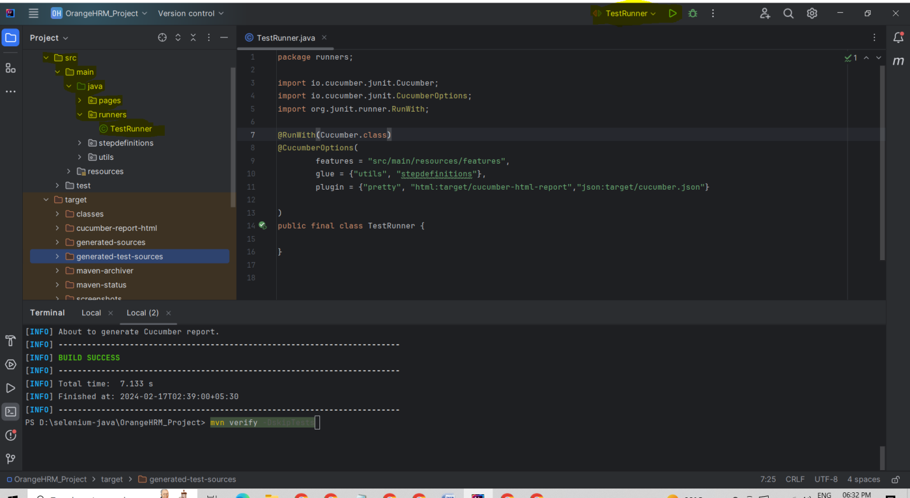
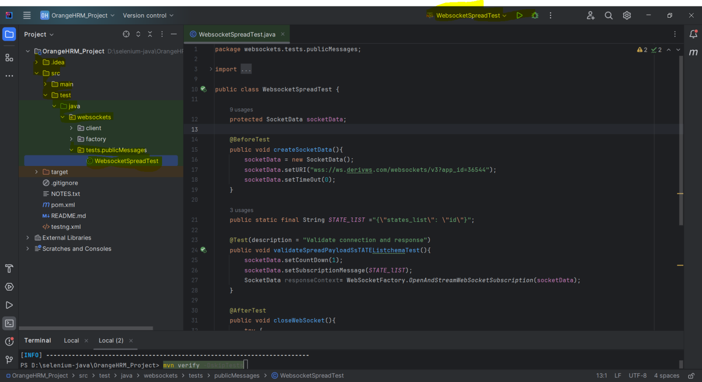

\# **OrangeHRM_Project**

This is a maven based Selenium-java Automation framework using Junit,
Cucumber, TestNG for testing OrangeHRM's 'Web Automation & Websocket API
Automation'.

1.  OrangeHRM's 'Web Automation

\## Test Run Reports:

a)To do execution, run the TestRunner file.

Runner_File_Path:src/main/java/runners/TestRunner.java

{width="6.5in" height="3.570117016622922in"}

> b)To generate the Reports, Execute the maven command after TestRunner
> execution.

Maven Command : mvn verify --DskipTests

It will generate the html reports under below path.

Report_Path: target/cucumber-report-html/cucumber-html-reports/js

Screaanshots_Path: target/screenshots

2.  OrangeHRM's Websocket API Automation'

\## WebSocket Test Run Results:

> a)To generate the result need to run WebsocketSpreadTest.java test
> file
>
> Test_File_Path: src/test/java/websockets/tests.publicMessages/
> WebsocketSpreadTest.java
>
> {width="6.5in" height="3.5385575240594926in"}

\## Dependencies

Maven will take care of all the project dependencies.

\`\`\`

\## Future Improvements

\* Testcases implementation

\* Parallel execution (Multithreading)

\* Allure report
